# Lab Notebook

Maintain Lab notebook here.

# Lab 1: Getting Started with Vi, Linux Commands, and Git

This first lab introduced the basics of working in a Linux terminal, editing files with **vi**, and using Git to create and clone repositories. The main goal was to become comfortable with common command-line tasks, simple text editing, and basic version control. Git is used to track file changes and manage project history, while `git clone` creates a local copy of a remote repository [web:11][web:12].

## Objectives

- Learn basic Linux commands.
- Understand the fundamentals of the `vi` editor.
- Create and clone a GitHub repository.
- Practice adding, committing, and pushing files with Git.

## Linux commands

Linux commands are used to work with files and folders directly from the terminal. Some of the most common commands in this lab are:

```bash
pwd
ls
cd
mkdir
touch
cat
cp
mv
rm
```

- `pwd` shows the current directory.
- `ls` lists files and folders.
- `cd` changes the current directory.
- `mkdir` creates a new folder.
- `touch` creates an empty file.
- `cat` displays file contents.
- `cp` copies files.
- `mv` moves or renames files.
- `rm` deletes files.

These commands form the basic workflow for navigating and managing files in Linux.

## Using vi

The `vi` editor is a terminal-based text editor. It is commonly opened from the command line using `vi filename`. `vi` starts in command mode, and you press `i` to enter insert mode so you can type text [web:16]. Press `Esc` to return to command mode, then use commands like `:w` to save, `:q` to quit, and `:wq` to save and quit [web:16].

### Common vi commands

- `vi filename` opens or creates a file.
- `i` enters insert mode.
- `Esc` returns to command mode.
- `:w` saves the file.
- `:q` quits `vi`.
- `:wq` saves and quits.
- `:q!` quits without saving.
- `x` deletes one character.
- `dd` deletes a line.

## Git and repository setup

Git is used to track changes in a project and maintain version history [web:12]. To start a new project, you can create a repository on GitHub by clicking **New repository**, giving it a name, optionally adding a README, and then creating it [web:12]. After that, you can clone the repository to your local computer using `git clone` [web:11][web:15].

### Creating a repository on GitHub

1. Sign in to GitHub.
2. Click **New repository**.
3. Enter a repository name.
4. Add a description if needed.
5. Choose public or private visibility.
6. Add a README if you want an initial file.
7. Click **Create repository** [web:12].

### Cloning a repository

To download the repository to your computer, open the terminal, move to the folder where you want the project, and run:

```bash
git clone https://github.com/swayams99/si2026-analog-notebook-Swayam.git
```

GitHub explains that `git clone` copies the repository from GitHub to your local machine [web:11][web:15]. After cloning, you can enter the folder and start working on the files.

```bash
cd si2026-analog-notebook-Swayam
```

## Basic Git workflow

A simple Git workflow for this lab looks like this:

```bash
git status
git add .
git commit -m "Add lab 1 notes"
git push
```

- `git status` checks the current state of the repository.
- `git add .` stages all changes.
- `git commit -m` saves a snapshot with a message.
- `git push` uploads the commit to GitHub.

If you are creating a brand-new repository locally, you can first initialize it with `git init`, then add files, commit them, and push them to GitHub.

## Example workflow

1. Open the terminal.
2. Use Linux commands like `ls` and `cd` to move to the desired folder.
3. Clone the repository with `git clone`.
4. Open or create a file using `vi`.
5. Edit the file in insert mode.
6. Save and exit with `:wq`.
7. Use Git commands to stage, commit, and push the changes.

## Conclusion

This lab gave a first introduction to Linux command-line usage, `vi` text editing, and Git repository management. These tools are the foundation for working efficiently in a terminal-based development environment and for keeping project files organized with version control 

# Lab 2: Voltage Divider, Thevenin Equivalent, and RC Response

This lab covered the **voltage divider circuit**, **Thevenin equivalence**, and basic transient behavior of an **RC circuit** in SPICE. The experiments helped show how output voltage changes with resistor values, how a circuit can be reduced to an equivalent source and resistance, and how a capacitor affects rise and fall times. The attached circuit image shows a simple RC network with input, output, and reference nodes [file:21].

## Voltage divider circuit

A voltage divider is made using two resistors in series, with the output taken from the midpoint. In the given netlist, `R1 = 1k` and `R2 = 1k`, so the output voltage is ideally half of the input voltage. The input is applied using a pulse source that switches between 0 V and 5 V with a delay and finite rise/fall times.

### Netlist

```spice
* Simple resistor voltage divider with a pulse input

R1      vin     vout    1k
R2      vout    0       1k

Vpulse  vin     0       PULSE 0 5 0.5u 10n 10n 0.5u 1u

.TRAN 0.1u 1.5u

.control
RUN
PLOT v(vout)
.endc

.end
```

### Explanation

- `R1 vin vout 1k` connects the input node to the output node.
- `R2 vout 0 1k` connects the output node to ground.
- `Vpulse` provides a 0–5 V pulse input.
- `.TRAN` runs a transient simulation to observe the output over time.
- `PLOT v(vout)` displays the voltage at the output node.

### Expected result

- When the input is 5 V, the output is about 2.5 V.
- When the input is 0 V, the output is about 0 V.
- Because the pulse has finite rise and fall times, the output transitions smoothly rather than instantly.

## Thevenin equivalent

The voltage divider can also be explained using **Thevenin’s theorem**. Any linear resistive network can be replaced by a single voltage source and a single series resistance at the output terminals. For a divider with equal resistors, the Thevenin voltage at the midpoint is half the input voltage. The Thevenin resistance is the parallel combination of the two resistors when the source is set to zero.

### For this divider

- \(V_{th} = V_{in} \times \dfrac{R_2}{R_1 + R_2}\)
- \(R_{th} = R_1 \parallel R_2\)

For `R1 = 1k` and `R2 = 1k`:

- \(V_{th} = 0.5V_{in}\)
- \(R_{th} = 500\ \Omega\)

This equivalent model helps simplify analysis when a load is connected to the output node.

## RC circuit response

The second part of the lab studied the transient response of an RC circuit. The circuit uses a resistor and capacitor to show how the output changes over time when a pulse input is applied. The attached screenshot shows the RC layout with input `in`, output `out`, and reference node `ref` 

### Netlist

```spice
* RC Step Response and RC Rise/Fall Time

V1 in 0 PULSE(0 5 0 1p 1p 10n 20n)

R1 in out 1k
C1 out 0 1p

.tran 1p 20n

.measure tran trise TRIG v(out) VAL=0.5 RISE=1 TARG v(out) VAL=4.5 RISE=1
.measure tran tfall TRIG v(out) VAL=4.5 FALL=1 TARG v(out) VAL=0.5 FALL=1

.control
run
plot v(in) v(out)
print trise
print tfall
.endc

.end
```

### Explanation

- `V1 in 0 PULSE(0 5 0 1p 1p 10n 20n)` creates a pulse from 0 V to 5 V.
- `R1 in out 1k` is the series resistor.
- `C1 out 0 1p` is the capacitor connected to ground.
- `.tran 1p 20n` runs the transient simulation.
- `.measure tran trise` measures rise time.
- `.measure tran tfall` measures fall time.
- `plot v(in) v(out)` compares input and output waveforms.

### What happens

- The capacitor charges when the input goes high.
- The capacitor discharges when the input goes low.
- The output waveform rises and falls more slowly than the input because of the RC time constant.

### Time constant

For this circuit, the time constant is:

\[
\tau = RC
\]

With `R = 1k` and `C = 1p`:

\[
\tau = 1 \text{ ns}
\]

This small time constant makes the output respond quickly, but still not instantly.

## RC Circuit Transient Analysis (Square Wave Response)

### Input Signal

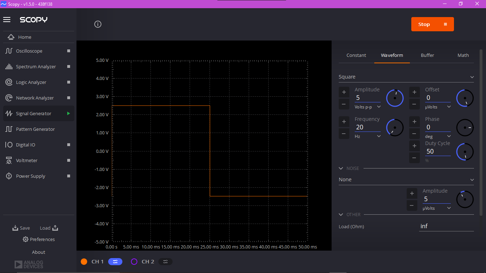

- **Signal Type:** Square wave  
- **Amplitude:** 5 V (peak-to-peak)  
- **Frequency:** 20 Hz  
- **Observation:**  
  - Input alternates between high and low levels periodically.  
  - Sharp transitions represent ideal switching behavior.  

---

### Output Response

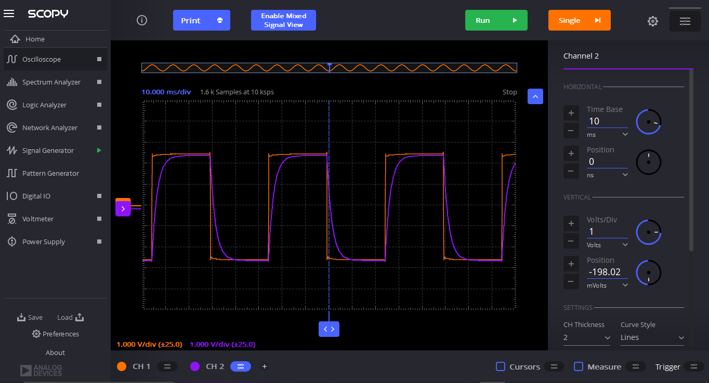

- **Circuit:** RC network (first-order system)  
- **Observation:**  
  - Output shows exponential rise and fall instead of sharp edges.  
  - During HIGH input → capacitor **charges** exponentially.  
  - During LOW input → capacitor **discharges** exponentially.  

---

### Key Insights

- The circuit behaves as a **low-pass filter**.  
- Output smoothens the square wave due to capacitor action.  
- Time constant governs the response:
  - $\tau = RC$  
- Faster transitions → smaller $\tau$  
- Slower curves → larger $\tau$  

---

### Conclusion

- The RC circuit converts a square wave into a **rounded waveform**.  
- Demonstrates **charging and discharging characteristics of a capacitor**.  
- Confirms theoretical first-order transient response.

---

## NMOS saturation analysis

The lab also included an NMOS study to observe the drain current versus gate-source voltage behavior in saturation. A Level-1 SPICE model was used to estimate device parameters from the square-root current relationship. The script also performs a DC sweep to analyze how the transistor behaves under different bias conditions.

### Netlist

```spice
* Title: Id-vs-Vgs for and NMOS in Saturation region
* Comparing the Level-1 and Level-49 SPICE model
* From sqrt(1*Id) vs Vgs, Vt, Kp and gamma can be extracted

.MODEL nmos1 NMOS (LEVEL=1 PHI=0.846 VT0=0.514 KP=122U GAMMA=0.55 LAMBDA=0.0)

.TEMP 27

M2      D2      D2      0       B       nmos1    W=5u L=1u
Vds     D       0       DC      5
Vid2    D       D2      DC      0
Vsb     0       B       DC      0

.DC     Vds     0       5       0.001  Vsb  0 1 0.5

.CONTROL
RUN
PLOT Vid2#branch vs V(D)
PLOT (2*Vid2#branch)^0.5  vs V(D)
.ENDC

.END
```

### Explanation

- `M2` is the NMOS transistor.
- `D2` and `D` are used to set up the biasing and measurement.
- `Vds` applies the drain-source voltage.
- `Vsb` sets the source-body voltage.
- `.MODEL nmos1` defines the transistor parameters.
- `.DC` sweeps the voltage to study current behavior.
- The plot of \(\sqrt{I_D}\) versus \(V_{GS}\) is useful for extracting threshold-related parameters.

## Main observations

- The voltage divider produced half the input voltage because both resistors were equal.
- The Thevenin equivalent gave a simpler way to analyze the divider.
- The RC circuit showed delayed charging and discharging due to the capacitor.
- The NMOS study demonstrated how transistor current changes with voltage bias and how SPICE can be used for device characterization.

# Voltage Divider Experiment using ADALM Kit and Scopy

## Overview
This project demonstrates the use of the **ADALM2000 kit** with **Scopy software (v1.5.0)** to measure voltages across a simple voltage divider circuit. The experiment highlights real-time voltage monitoring using Scopy’s **Voltmeter tool**.

## Circuit Details
- **Circuit Type:** Voltage Divider  
- **Resistor Used (R):** 1 kΩ  
- **Configuration:** Two resistors connected in series, input voltage applied across the series, output voltage measured across one resistor.

## Tools Used
- **Hardware:** ADALM2000 (Analog Devices Active Learning Module)  
- **Software:** Scopy v1.5.0  
- **Measurement Tool:** Voltmeter (Channels 1 & 2)

## Measurement Results
### Channel 1 (Orange)
- **Minimum Voltage:** 0.233 V  
- **Maximum Voltage:** 2.522 V  
- **Current Reading:** 2.472 V DC  

### Channel 2 (Purple)
- **Minimum Voltage:** -0.067 V  
- **Maximum Voltage:** 1.249 V  
- **Current Reading:** 1.247 V DC  

## Scopy Interface Snapshot
Below is the screenshot of the Scopy Voltmeter tool showing the real-time measurements:

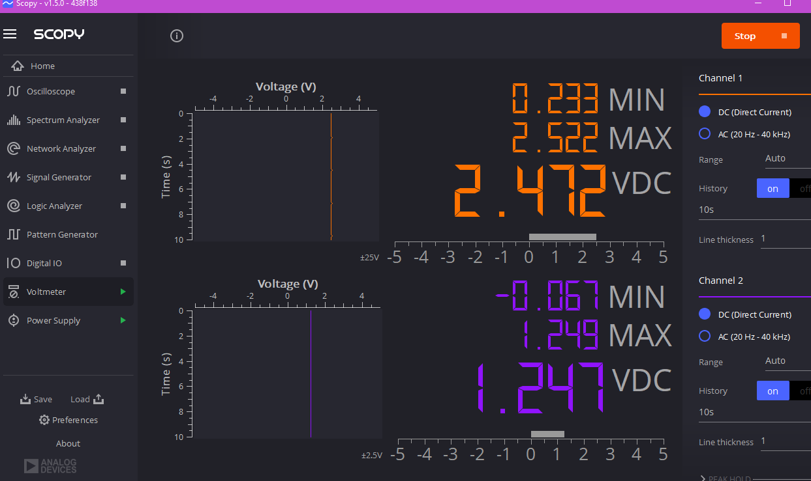


## Observations
- The voltage divider correctly splits the input voltage across the two resistors.  
- Channel 1 shows the higher voltage (closer to input), while Channel 2 shows the divided voltage.  
- The readings confirm the expected behavior of a voltage divider circuit.

## Conclusion
This experiment validates the functionality of the voltage divider using a **1 kΩ resistor setup** and demonstrates how the **ADALM2000 kit with Scopy** can be used for accurate voltage measurements and visualization.
 Scopy’s Signal Generator and Oscilloscope modules for educational and diagnostic purposes.

 # Signal Generation and Oscilloscope Analysis using ADALM Kit and Scopy

## Overview
This experiment demonstrates how to use the **Signal Generator (W1)** in **Scopy (v1.5.0)** to produce a sine wave and observe it in real time using the **Oscilloscope (Channel 1)**. The setup highlights waveform generation, parameter control, and signal visualization.

## Circuit / Setup Details
- **Hardware:** ADALM2000 Active Learning Module  
- **Software:** Scopy v1.5.0  
- **Tools Used:** Signal Generator (W1), Oscilloscope (CH1)  
- **Waveform Type:** Sine Wave  
- **Connections:**  
  - W1 output from Signal Generator connected to Oscilloscope Channel 1 input  
  - Channel 2 left unconnected (baseline reference)

## Signal Generator Parameters
- **Amplitude:** 10 Vpp (Peak-to-Peak)  
- **Frequency:** 1 kHz  
- **Offset:** 0 µV  
- **Phase:** 0°  
- **Noise:** Disabled  

## Oscilloscope Measurements
### Channel 1 (Orange Sine Wave)
- **Time Base:** 100 µs/div  
- **Voltage Scale:** 2 V/div  
- **Observed Signal:** Clear sine wave at 1 kHz, 10 Vpp  

### Channel 2 (Blue Line)
- **Observed Signal:** Flat baseline at 0 V (no input connected)

## Scopy Interface Snapshots
### Signal Generator Output (W1 → CH1)
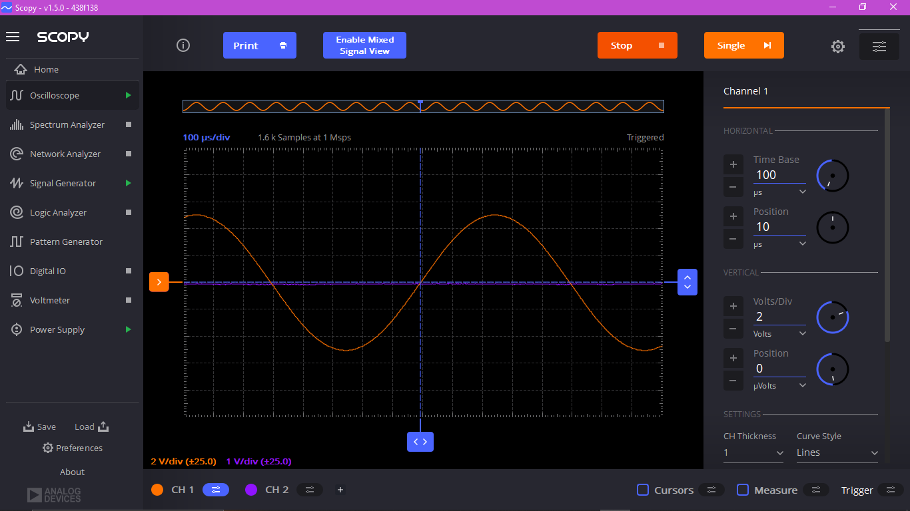

### Oscilloscope Observation (CH1)
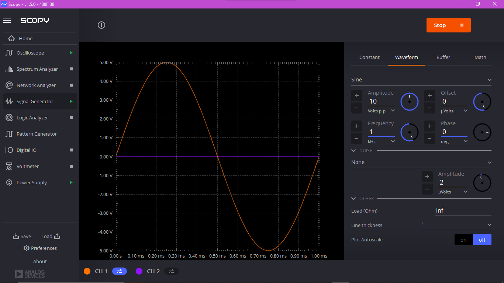

*(Ensure the image paths match the actual filenames in your repo.)*

## Observations
- The Signal Generator (W1) successfully produced a stable sine wave at the configured parameters.  
- The Oscilloscope (CH1) confirmed the waveform characteristics (frequency, amplitude, and phase).  
- Channel 2 remained flat, validating that no signal was applied.  
- The experiment demonstrates how Scopy integrates signal generation and measurement seamlessly.

## Conclusion
This lab illustrates the process of generating and analyzing signals using the **ADALM2000 kit**. The results confirm the accuracy of Scopy’s Signal Generator and Oscilloscope modules for educational and diagnostic purposes.

---
# MOSFET Parameter Extraction using ngspice (Sky130 PDK)

## 📌 Overview
This report documents simulations performed in **ngspice** to extract MOSFET parameters.  
The experiments include:
- **Level‑1 vs Level‑49 model comparison** of Id–Vgs characteristics.
- **Threshold voltage (Vt) extraction** using different bias points.
- **Overall parameter calculation** including Vt and body effect coefficient (γ).

---

## 🖼️ Simulation Snapshots

### 1. Level‑1 vs Level‑49 Id–Vgs Comparison
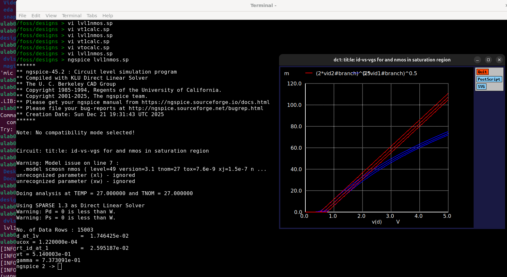

- **Description:** Id–Vgs characteristics plotted for NMOS using two different SPICE models:  
  - **Level-1:** Simplified analytical MOSFET model.  
  - **Level-49:** BSIM3 advanced model with process parameters.  

- **Observation:**  
  - Level-1 curve shows idealized behavior.  
  - Level-49 curve captures short-channel effects, mobility degradation, and realistic threshold voltage.  

- **Extracted Parameters:**  
  - $V_t \approx 0.514 \, \text{V}$  
  - $\gamma \approx 0.737$  

---

### 2. Threshold Voltage Extraction (Method A)
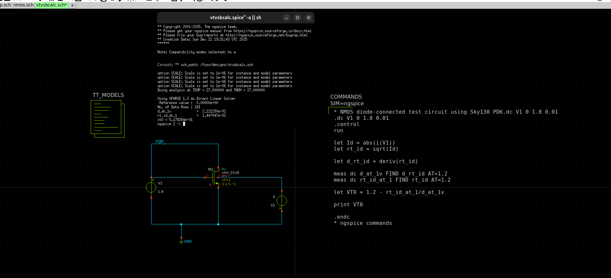
- **Circuit:** Diode-connected NMOS (gate tied to drain).  
- **Method:** Sweep $V_{gs}$ from 0–1.8 V, compute $\sqrt{I_d}$, and extrapolate.  
- **Result:**  
  - $V_{T0} \approx 0.518 \, \text{V}$  

---

### 3. Threshold Voltage Extraction (Method B)
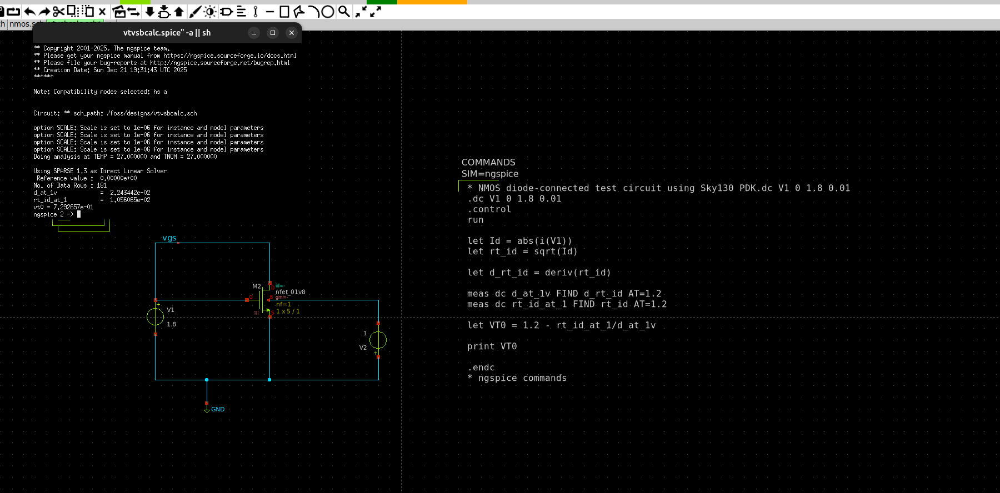

- **Circuit:** Same diode-connected NMOS, but evaluated at a different bias point.  
- **Method:** Derivative of $\sqrt{I_d}$ at $V_{gs} = 1.2 \, \text{V}$.  
- **Result:**  
  - $V_{T0} \approx 0.729 \, \text{V}$  
- **Note:** Higher threshold due to body bias effect.
---

### 4. Overall Vt and γ Calculation
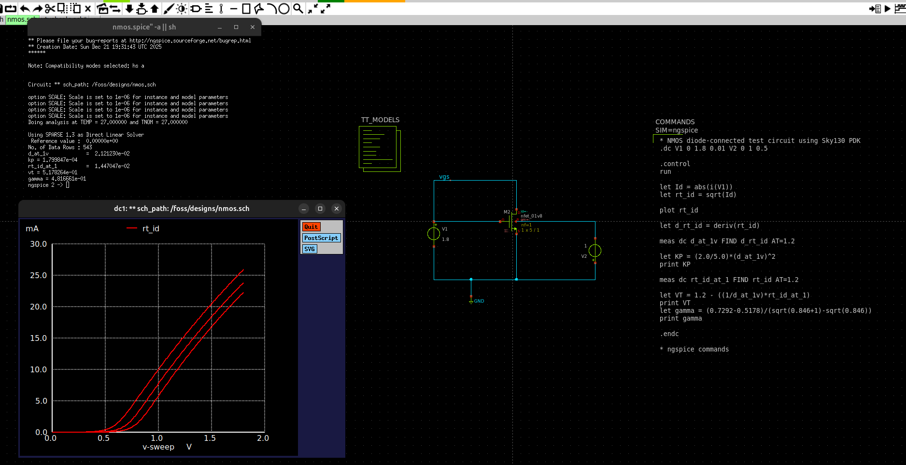
### Post-Processing Equations

- Kp = (2/5) × (d_rt_id)²  
- Vt = 1.2 − (rt_id / d_rt_id)  
- γ = (0.7292 − 0.5178) / (√0.8461 − √0.846)  

---

### Extracted Values

- Kp ≈ 1.80 × 10⁻⁴  
- Vt ≈ 0.518 V  
- γ ≈ 0.482

---

## 📊 Summary of Results
## Summary of Results

| Experiment                     | Parameter(s)           | Value(s) |
|--------------------------------|------------------------|----------|
| Level-1 vs Level-49           | Threshold voltage, γ   | Vt ≈ 0.514 V, γ ≈ 0.737 |
| Vt Extraction (Method A)      | Threshold voltage      | Vt ≈ 0.518 V |
| Vt Extraction (Method B)      | Threshold voltage      | Vt ≈ 0.729 V |
| Overall Calculation           | Kp, Vt, γ              | Kp ≈ 1.8 × 10⁻⁴, Vt ≈ 0.518 V, γ ≈ 0.482 |

---

## 📝 Conclusion
- **Level‑49 model** provides realistic MOSFET behavior compared to the idealized Level‑1.  
- **Threshold voltage** varies depending on extraction method and bias point, confirming the **body effect**.  
- **γ (body effect coefficient)** quantifies the sensitivity of Vt to substrate bias.  
- These simulations demonstrate how ngspice can be used for **device characterization** in semiconductor design.

---
### Two-Stage CMOS Operational Amplifier: DC and AC Performance Analysis
## 1. DC Sweep Analysis (Id–Vgs & Vout)

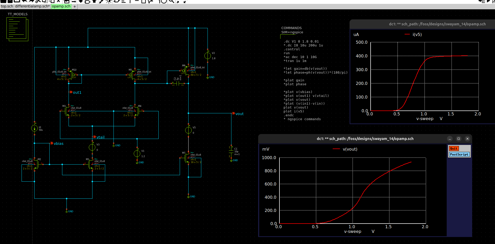

- **Circuit:** Two-stage CMOS operational amplifier (differential input + current mirror load + gain stage).  
- **Method:** DC sweep performed by varying input voltage from 0 to 1.8 V.  

- **Observations:**  
  - Drain current increases nonlinearly with $V_{gs}$, showing typical MOSFET saturation behavior.  
  - Output voltage ($V_{out}$) rises gradually after threshold and shows strong gain region.  

- **Key Insight:**  
  - The transition region indicates the effective threshold voltage of the input pair.  
  - Nonlinear slope confirms square-law behavior in saturation.

---

### 2. AC Frequency Response (Gain vs Frequency)

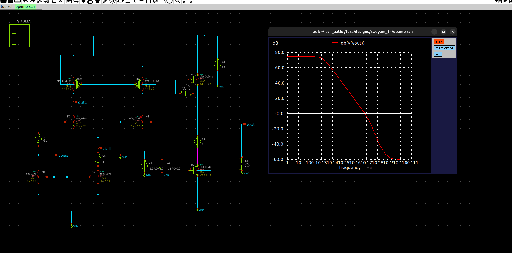

- **Method:** AC analysis using small-signal input over a wide frequency range (1 Hz to GHz).  

- **Observations:**  
  - High DC gain of approximately **70–75 dB**.  
  - Gain decreases with frequency, showing a dominant pole.  
  - Slope ≈ **-20 dB/decade** initially, indicating single-pole behavior.  
  - Additional poles cause steeper roll-off at higher frequencies.  

- **Key Parameters:**  
  - **DC Gain:** ~70 dB  
  - **Bandwidth:** Limited by dominant pole  

- **Conclusion:**  
  - Circuit is stable with dominant pole compensation.  
  - Suitable for low-frequency amplification applications.

---

### 3. Output Frequency Response (Linear Scale)

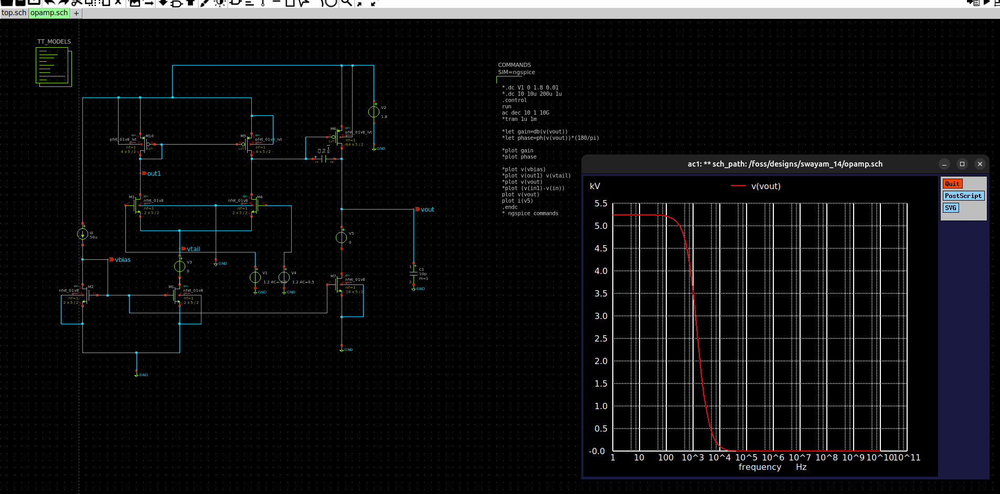

- **Method:** AC analysis observing $V_{out}$ magnitude in linear scale.  

- **Observations:**  
  - Output voltage is high at low frequencies (~5 V gain equivalent).  
  - Rapid drop in output magnitude after cutoff frequency.  

- **Key Insight:**  
  - Sharp roll-off indicates dominant pole.  
  - Confirms gain-bandwidth trade-off.  

- **Conclusion:**  
  - Strong low-frequency gain but limited high-frequency performance.

---


